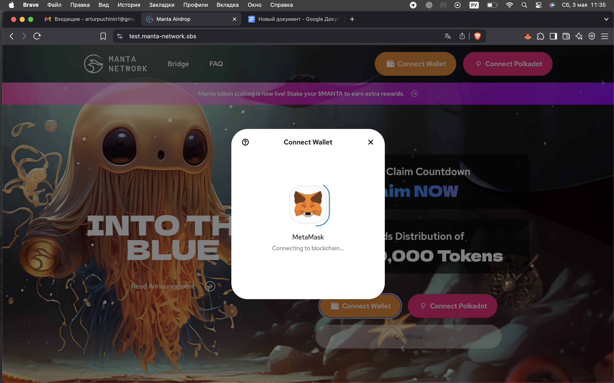
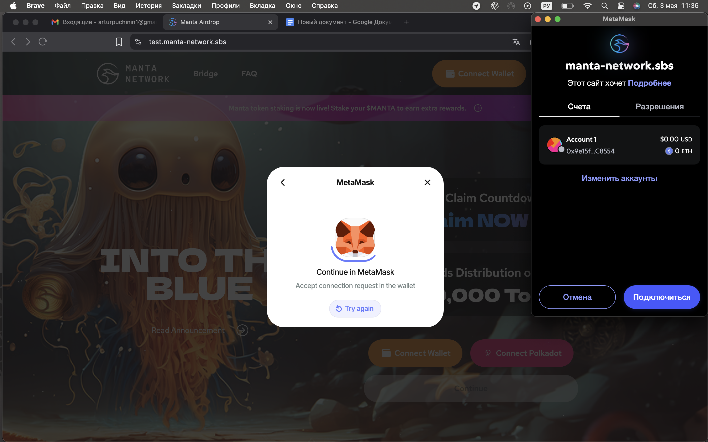

# QA Report: Manta Network Airdrop Page

🗓 **Date:** May 3, 2025    
**Tested URL:** [URL removed for safety due to MetaMask block warning]
👤 **Tester:** Artur Puchinin

---

## 🔍 Summary

The authorization flow on the Manta Network airdrop test page is currently non-functional. MetaMask opens and prompts for connection in both Brave and Chrome, but after wallet approval, the UI resets to its initial state with no feedback or progression. This prevents further testing of the claim process and related functionality.

---

## 🧪 Test Environment

- **Browsers:**  
  Brave 1.66.115  
  Google Chrome 123.0.6312.122

- **OS:** macOS Sonoma 14.4.1  
- **Wallet Extension:** MetaMask 11.11.2

---

## ✅ 1. Authorization Flow

**Wallet Connection Behavior:**  
MetaMask opens and requests permission to connect. Once access is granted, the page reloads but returns to the initial state, still prompting “Connect Wallet.”

**Clarity of Prompts:**  
MetaMask dialogs are clear and standard.

**Error Handling:**  
No error messages are shown when connection fails or does not proceed. The user receives no feedback.

**Post-Connection Feedback:**  
There is no visual or functional confirmation that the wallet is connected (e.g., wallet address display, state change, or success message).

---

## ⛔ 2. Testing Limitations

Due to the broken connection logic, the following aspects could not be tested:

- The “Continue” button remains inactive after wallet approval  
- Airdrop claim logic  
- Address validation  
- Mobile responsiveness and layout consistency  
- Error and success messages  
- Cross-browser differences beyond initial connection flow

---

## 💡 Suggestions

- Add visual confirmation of wallet connection (e.g., address badge)  
- Show error messages for failed or delayed connections  
- Add debug mode with console logs for testers  
- Provide fallback tips for connection issues

---

## 📸 Screenshots

_The following screenshots document each step of the wallet connection process:_

| Step | Description                          | Screenshot                                  |
|------|--------------------------------------|---------------------------------------------|
| 1    | Initial screen – "Connect Wallet" & "Connect Polkadot" visible |  |
| 2    | MetaMask popup – “Connecting to blockchain…” |  |
| 3    | User confirms connection             |  |
| 4    | Page reloads – returns to initial state |  |

---

**Contact:**  
Artur Puchinin  
Telegram: [@pu_chao](https://t.me/pu_chao)  
Email: puchinin64@gmail.com
